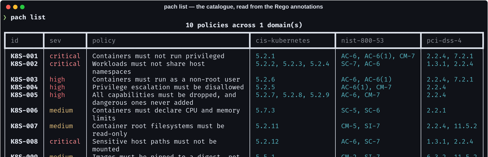
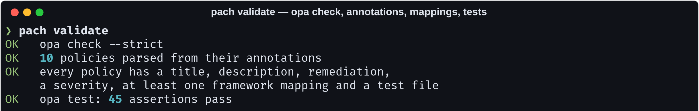
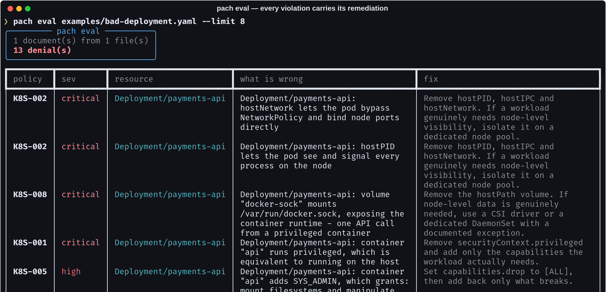
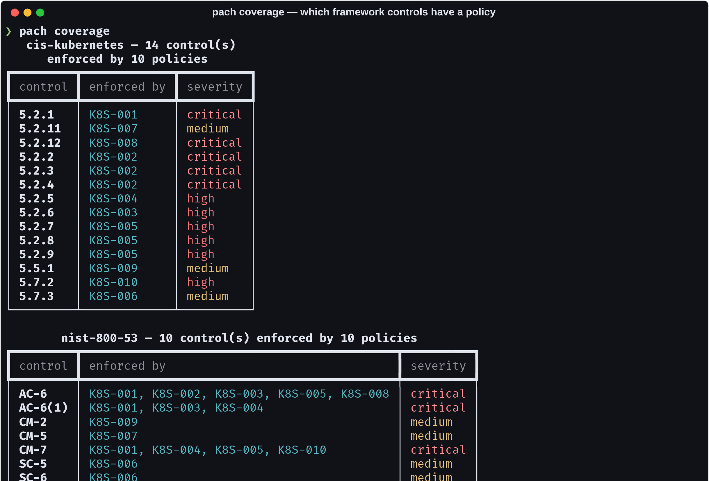

# policy-as-code-hub

> Policy catalogues drift. The YAML that says a rule maps to CIS 5.2.1 stops
> matching the rule within a release, and nothing catches it because nothing
> reads both. Here the metadata lives **inside the Rego**, so OPA fails to
> compile a policy whose annotations are broken.

[](https://github.com/Vincent-P-essy/policy-as-code-hub/actions/workflows/ci.yml)
[](policies)
[](policies)
[](#coverage)
[](policies)
[](LICENSE)

Curated OPA policies for Kubernetes, each mapped to CIS Kubernetes, NIST 800-53
and PCI-DSS v4 controls, each with its own test file, packaged as a
distributable OPA bundle.



## Metadata in the policy, not beside it

```rego
# METADATA
# title: Containers must not run privileged
# description: |
#   `privileged: true` disables every isolation mechanism at once - all
#   capabilities, all devices, no seccomp, no AppArmor.
# custom:
#   id: K8S-001
#   severity: critical
#   remediation: Remove securityContext.privileged and add only the capabilities the workload actually needs.
#   frameworks:
#     cis-kubernetes: ["5.2.1"]
#     nist-800-53: ["AC-6", "AC-6(1)", "CM-7"]
#     pci-dss-4: ["2.2.4", "7.2.1"]
package kubernetes.privileged
```

`pach` reads that through `opa inspect -a` — it is a reader, not a second copy
of the data. A sidecar YAML file describing the same policy would be wrong
within a release and nobody would notice.

## Every policy has tests, and they run for real



45 Rego assertions, executed by `opa test`. This project does **not**
reimplement Rego: a second evaluator that agrees with OPA 95% of the time is
worse than none, because the 5% is where a policy passes in CI and fails at
admission.

`pach validate` fails the build when a policy has no remediation, no framework
mapping, or no test file beside it. A policy nobody has shown to work is not
one to ship to an admission controller.

## The helper that makes the policies correct

Every policy goes through `lib.workload`:

```rego
pod_spec := input.spec.template.spec  if input.kind in {"Deployment", "StatefulSet", ...}
pod_spec := input.spec.jobTemplate.spec.template.spec  if input.kind == "CronJob"
pod_spec := input.spec  if input.kind == "Pod"

containers contains c if some c in object.get(pod_spec, "initContainers", [])
```

A policy that walks `input.spec.containers` directly works on a bare Pod and
**silently passes every Deployment in the cluster**. That is the failure mode
that makes a policy library dangerous rather than merely incomplete, and there
is a test for each kind.

The same helper merges the pod-level `securityContext` with the container's,
container wins — because a workload can declare `runAsNonRoot` on the pod and
then override it back on the container, and a policy reading only the pod level
calls that hardened.

## Evaluating manifests



Every violation carries the policy that raised it and that policy's own
remediation text. `deny` fails the build; `warn` does not — an image pinned to
a version tag warns, an image on `:latest` denies.

## Coverage



Coverage means a control **has a policy**, not that the control is satisfied. A
mapped control whose policy nobody runs is still a gap, and the tool says so
rather than letting a green table imply otherwise.

## Install and run

```bash
# OPA is required — this curates policies, it does not replace the engine
curl -fsSL -o /usr/local/bin/opa \
  https://openpolicyagent.org/downloads/v1.18.2/opa_linux_amd64_static
chmod +x /usr/local/bin/opa

git clone https://github.com/Vincent-P-essy/policy-as-code-hub
cd policy-as-code-hub
pip install -e .

pach list                                     # the catalogue and its mappings
pach coverage                                 # per-framework control coverage
pach validate                                 # opa check --strict, annotations, tests
pach eval k8s/                                # evaluate your manifests
pach bundle --revision "$(git rev-parse HEAD)"
```

Without OPA on `PATH`, every command exits 3 with an explanation rather than
half-working.

## Distribution

```bash
pach bundle --out dist/policies.tar.gz --revision "$(git rev-parse HEAD)"
opa run --server --bundle dist/policies.tar.gz
```

`pach bundle` **refuses to build when the tests fail** unless you pass
`--force`. A bundle is what reaches an admission controller; building a broken
one silently is how a cluster starts rejecting valid workloads at 02:00.

## The catalogue

| id | severity | policy | CIS K8s |
| --- | --- | --- | --- |
| `K8S-001` | critical | Containers must not run privileged | 5.2.1 |
| `K8S-002` | critical | Workloads must not share host namespaces | 5.2.2–5.2.4 |
| `K8S-003` | high | Containers must run as a non-root user | 5.2.6 |
| `K8S-004` | high | Privilege escalation must be disallowed | 5.2.5 |
| `K8S-005` | high | All capabilities dropped, dangerous ones never added | 5.2.7–5.2.9 |
| `K8S-006` | medium | Containers must declare CPU and memory limits | 5.7.3 |
| `K8S-007` | medium | Container root filesystems must be read-only | 5.2.11 |
| `K8S-008` | critical | Sensitive host paths must not be mounted | 5.2.12 |
| `K8S-009` | medium | Images pinned to a digest, not a floating tag | 5.5.1 |
| `K8S-010` | high | A seccomp profile must be set | 5.7.2 |

Each denial message says what it costs, not just what it is —
`SYS_ADMIN` reports *"grants: mount filesystems and manipulate namespaces —
effectively root"*, and the Docker socket reports *"one API call from a
privileged container"*.

## Where this stops

- **Kubernetes only, so far.** The `terraform/` and `docker/` directories exist
  and are empty; adding a domain means writing the policies and their tests, not
  changing the tooling.
- **Ten policies, not a hundred.** Every one is mapped, tested and has a
  remediation. A larger catalogue of untested rules would score better on a
  README and worse in production.
- **Coverage is a mapping claim.** It says a control has a policy. Whether the
  policy is enforced anywhere is a deployment question.
- **`opa check --strict` and `opa test` are the quality bar.** There is no
  custom linting of Rego beyond what OPA itself does.
- **No conftest wrapper.** These are plain Rego bundles; conftest reads them
  directly if that is your pipeline.

## Layout

```
policies/
  lib/workload.rego        pod spec, containers, merged security context, per kind
  kubernetes/*.rego        10 policies, each with a *_test.rego beside it
src/pach/
  catalogue.py   reads the annotations via `opa inspect -a`
  evaluate.py    `opa eval`, `opa test`, `opa check`, `opa build`
  cli.py         list · coverage · validate · test · eval · bundle
examples/        a bad and a hardened Deployment
```

## Licence

MIT
